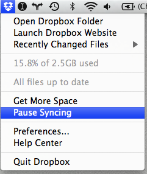

Reading List Scripts
====================

This repository contains a handful of scripts that I've found useful for creating a reading list of academic papers that syncs to my mobile devices and the web. The scripts allow you to flag papers in Papers.app, and have those papers appear in a Dropbox folder. This lets you read those papers from iOS devices and the web. Another script will also sync a folder of papers from Dropbox to a Kindle locally when you connect the Kindle.

If you're uncomfortable using these scripts, [Papers Touch][PapersTouch] is much easier to use for syncing your Papers library to your iOS devices.

[PapersTouch]: http://www.mekentosj.com/papers/touch

Set up a sandbox
----------------

Before you start playing with the scripts, pause Dropbox syncing to make sure you are happy with the results before actually sending data to the Dropbox server. To do this choose **Pause Syncing** from the Dropbox menu.

Getting Started
---------------

There are two scripts included in the repository for getting the reading list from Papers.app. One version of the script is for Papers 1.8+ and one version of the script is for Papers 2.0+. The scripts should not be used at the same time (they will overwrite the reading list, which may lead to a lot of dropbox syncing). 

First, you will want to make the scripts executable by your user account. For example, if you want to use the Papers 2 script, you might run:

    chmod u=rwx com.adamfaeth.readinglist.papers2.sh

After making each script that you want to run executable, you can experiment with the scripts before installing them. Installation only helps the scripts to run automatically.

Running the scripts automatically
---------------------------------

Before you can have the reading list script run automatically, you will need to edit the plist file to tell launchd when and how to run the scripts. For example, if you have Papers 2.0, you will need to edit the **com.adamfaeth.readinglist.papers2.plist** file. 

Change the working directory key so that it contains the absolute path to your user's home directory. You can find out your short username by typing `whoami` in the terminal.

    <key>WorkingDirectory</key>
    <string>/Users/__my_username__</string>

You can also change when the script will sync your reading list by customizing the `StartCalendarInterval` key. Here it is set to run at 5:32 p.m., and if the computer is asleep at that time, it will run the next time it wakes up.

    <key>StartCalendarInterval</key>
        <dict>
             <key>Hour</key>
                 <integer>17</integer>
             <key>Minute</key>
                 <integer>32</integer>
        </dict>

Instead of using launchd to run the Kindle scripts, I run them with an automator action which also downloads my Instapaper articles. I've included that workflow too.

Installation
------------

Before installing, please look over the scripts to get an understanding of what they do. They aren't too complicated and you will want to have a basic understanding of how they work before using them. The makefile is provided as a convenience.

To install the scripts for Papers2, you can run:

    make install

Instead, to install the scripts for Papers1, you can run:

    make install-papers1
    
The Kindle Scripts work with either version of the above script.

    make install-kindle

There are Automator workflows included for calling the scripts when the Kindle gets connected and calling the reading list script from the OS X services menu. The simplest way to install these actions is to open the workflows. Automator will ask if you want to install them as a folder action (on the /Volumes folder) and a service respectively. 
  
To test if the scripts are working correctly, you can have launchd kick off the script immediately. Errors will be reported in the console, rather than in the terminal. 

    launchctl start com.adamfaeth.readinglist

Using the Reading List
----------------------

In Papers.app, choose the papers that you want to put in your reading list by selecting the paper and choosing *Paper->Mark As Flagged* or clicking on the flag column in the list of papers. Papers that you flag will show up your `Dropbox/ReadingList` folder the next time that the script runs.

Note that if you already had papers flagged, these will be added to your reading list. If you already had a large number of papers flagged, but you don't want these papers in your Reading List on Dropbox, you might want to add these to another folder and uncheck them before running the reading list scripts. The scripts do not support narrowing your reading list down by folder, etc. All flagged papers will be synced to Dropbox, and you will need enough space on your Dropbox account to contain your reading list.

Resume syncing
--------------

Once you are happy that the scripts are syncing the papers you expect to your local dropbox folder, you can resume syncing. In the Dropbox menu, choose *Resume Syncing*.